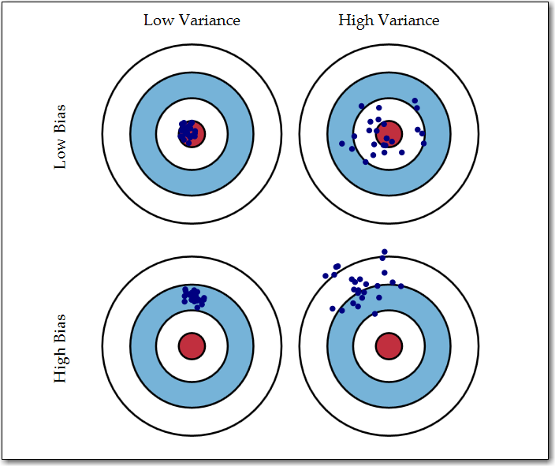

```{r setup, include=FALSE}
knitr::opts_chunk$set(message=FALSE, error=FALSE, warning=FALSE, comment=NA)
# switch this to TRUE to save figures in separate files
savefigs <- FALSE
```


# Resampling Methods

-----

Material in these notes are from the book Introduction to Statistical Learning, versions1 and 2 and a Tidyverse take on using the methods given at https://beaulucas.github.io/tidy_islr/resampling-methods.html. Material was then edited by Professor Kapitula.

We will use tidymodels here, [https://www.tidymodels.org/]


```{r, results="hide"}
library(tidyverse)
library(knitr)
library(skimr)
library(ISLR)
library(tidymodels)
library(moderndive)
library(skimr)
library(rstanarm)
library(bayesplot)
```

You have read in Chapter 2, in ISLR about Training Error and Test Error.  Before we get going pair off and discuss what the difference is between training error and test error. Why do we want to minimize test error? 

Consider a discussion about the bias and variance trade-off.  How would you answer the question, what do the words bias and variance mean in this context?


# Resampling Methods

-----


Resampling methods involve repeatedly drawing samples from a training set and refitting a model of interest on each sample. This provides additional information about the fitted model.

If we wanted to estimate the variability of a linear regression fit, we could repeatedly draw different samples from the training data, fit a linear regression model to each sample, and then measure how our fits differ. This can yield us novel information that would otherwise not be available from fitting a single model using the entirety of the training data.

It is computationally expensive to repeatedly fit statistical methods across different subsets of data. In most cases, this cost is not prohibitive.

In this chapter, we will look at two of the most common resampling methods, *cross-validation* and the *bootstrap*. Cross-validation can be used to estimate the test error associated with a given statistical learning method or to select the appropriate level of flexibility. Evaluating a model's performance is known as *model assessment*. Selecting the proper level of flexibility for a model is *model selection*. The bootstrap is most commonly used to provide a measure of accuracy of a parameter estimate or of a given statistical learning method.

## Cross-Validation

Let's remember the distinction between the *test error rate* and the *training error rate*.

The test error is the average error that results from using the statistical learning method to predict the response on a new observation (test dataset). In general, the method with the lowest test error is warranted to use. If a designated test set is available, then calculating the test error is trivial. Unfortunately, there are times when a a reasonably-sized test dataset is difficult or impossible to achieve.

The training error can be calculated by applying the statistical learning method to the observations used in its training. But this training error is often quite different from the test error rate, and in particular can significantly underestimate the test error rate.

Without a large, designated test set, a number of techniques can be used to estimate this quantity using the training data. Some methods make a mathematical adjustment to the training error rate (discussed in Chapter 6 TODO add link). In this chapter, we instead consider a class of methods that estimate the test error rate by *holding out* a subset of the training observations from the fitting process.

### The Validation Set Approach

The *validation set approach* is a strategy to estimate the test error associated with fitting a particular statistical learning method on a set of observations. It involves randomly diving the available set of observations into two parts, a *training set* and a *validation set* or *hold-out set*. The model is fit on the training set, and the model is then used to predict responses for observations in the validation set. The resulting validation set error rate provides an estimate of the test error rate.

Let's try this out on the `ISLR::Auto` dataset. We can utilize [`{rsample}`](https://tidymodels.github.io/rsample/index.html) (part of the `{tidymodels}` ecosystem) to handle this. 

```
The scope of rsample is to provide the basic building blocks for creating and analyzing resamples of a data set but does not include code for modeling or calculating statistics.
```

```{r}
set.seed(1) #good idea to set a seed when using methods that involve randomness
auto <- ISLR::Auto %>% as_tibble()
split_auto <- initial_split(auto, prop = 1 / 2)
train_auto <- training(split_auto)
test_auto <- testing(split_auto)
```

We split the data using `initial_split()`, and then assigned splits to training and validation (test) sets.

```{r}
nrow(train_auto) == nrow(test_auto)
```

Now let's fit various regression models on the `train_auto` dataset. We will repeat the sampling process and fit linear regression models for polynomials from 1st to 10th degree. All in all, we create 50 fits, each fit and tested on a random, one-half sample of the data.

```{r}
# copied from https://uc-r.github.io/resampling_methods
df_mse <- tibble(
  sample = vector("integer", 100),
  degree = vector("integer", 100),
  mse = vector("double", 100)
)
counter <- 1
for (i in 1:5) {
  # random sample
  set.seed(i)
  split_auto <- initial_split(auto, prop = 1 / 2)
  train_auto <- training(split_auto)
  test_auto <- testing(split_auto)
  # modeling
  for (j in 1:10) {
    lm.fit <- linear_reg() %>%
      fit(
        data = train_auto,
        formula = mpg ~ poly(horsepower, j)
      )
    lm_preds <- predict(lm.fit, new_data = test_auto)
    # calculate mse
    mse <- test_auto %>%
      bind_cols(lm_preds) %>%
      summarise(mse = mean((.pred - mpg)^2)) %>%
      pull()
    # add degree & mse values to tibble
    df_mse[counter, 2] <- j
    df_mse[counter, 3] <- mse
    # add sample identifier
    df_mse[counter, 1] <- i
    counter <- counter + 1
  }
  next
}
```

```{r}
ggplot(df_mse, aes(x = degree, y = mse, color = factor(sample))) +
  geom_line(show.legend = FALSE) +
  geom_point(show.legend = FALSE) +
  # scale_x_continuous(breaks = scales::pretty_breaks())
  ylim(c(10, 30))
```

While the curves vary in MSE values, they all exhibit a similar shape. All five curves indicate that the model with a quadratic term has a significantly smaller MSE than the linear term. All curves also include there isn't much additional benefit in extended beyond cubic or higher-order polynomials in the model. However, the variability of the curves and different test MSE estimates generated by each fit can only lead us to conclude that a linear fit is not adequate for this data.

There are two drawbacks of the validation set approach:

1. The validation estimate of the test error rate can be highly variable depending on which observations are included in the training set and which are included in the validation set.

2. Only a subset of observations are used to fit the model. Statisticsl methods perform worse when trained on fewer observations. In some cases, this sample size problem can lead the validation set error rate to be an *overestimate* of the test error rate.

### Leave-One-Out Cross-Validation.

*Leave-one-out cross-validation (LOOCV)* is related to the validation set approach.

LOOCV also involves splitting the set of observations into two parts. However, a single observations $(x_1, y_1)$ is used for the validation set. The remaining observations make up the training set. We fit the model on the $n - 1$ training observations, and make a prediction for the excluded observation. Since the held-out observation was not used in the training set, it provides an approximately unbiased estimate for the test error. While it may be unbiased, it is highly variable, causing it to be a poor estimate.

We can repeat this procedure by holding out different observations, again fitting the model on the remaining $n - 1$ observations, and computing the MSE of the held-out observation. If we repeat this approach $n$ times, we generate $n$ squared errors. The LOOCV estimate for the test MSE is the average of these $n$ test error estimates.

<div>
<p style="text-align:center">$CV_(n) = \frac{1}{n} \sum_{i=1}^{n}MSE_i$</p>
</div>

LOOCV has a couple of major advantages over the validation set approach. First, it has far less bias. We are repeatedly fitting the statistical learning method to almost all the observations in the entire dataset. As a result, it tends to not overestimate the test error rate as much as the validation set approach does. Secondly, performing LOOCV multiple times will always yield the same results. There is no randomness in the training/validation set splits.

Since LOOCV has to fit $n$ times, it can be expensive to implement on large datasets or high-computational statistical learning methods. For least squares linear or polynomial regression, the cost of LOOCV is actually the same as a single model fit if we take advantage of an observation's leverage.

<div>
<p style="text-align:center">$CV_(n) = \frac{1}{n} \sum_{i=1}^{n}(\frac{y_i - \hat{y}_i}{1-h_i})^2$</p>
</div>

In this case, we divide residuals of a fitted observation by how much that observation influences its own fit.

LOOCV can be used with any kind of predictive modeling.

### k-Fold Cross-Validation

An alternative to LOOCV is *k-fold CV*. This approach involves randomly dividing the set of observations into *k* groups, or *folds*, of approximatelty equal size. The first fold is treated as a valdation set, and the method is fit on the remaining $k - 1$ folds. The mean squared error, $MSE_1$, is then computed on the observations in the held-out fold. This procedure is repeated $k$ times. Each time, a different group of observations is treated as a validation set. This process results in $k$ estimates of the test error, $MSE_1, MSE_2, ..., MSE_k$. The $k$-fold CV estimate computed by averaging these values,

<div>
<p style="text-align:center">$CV_(k) = \frac{1}{k} \sum_{i=1}^{k}MSE_i$</p>
</div>

We can also think of LOOCV as a special case of $k$-fold CV in which $k$ is set equal to $n$. It is common to find $k$-fold CV operations using $k = 5$ or $k = 10$. Part of using small values of $k$ is computational costs, especially with large datasets and/or expensive learning methods. Later on, we will also discus non-computational advantages of low $k$-fold CV, which involve the bias-variance tradeoff.

With real data, we do not know the *true* test MSE. With simulated data, we can compute the true test MSE and actually compare how accurate cross-validation is.


When we perform cross-validation, our goal might be to determine how well a statistical learning method can be expected to perform on independent date. In other cases, we are interested in the location of the *minimum point in the estimated test MSE curve*. This is because we might be performing cross-validation on a number of different statistical learning methods, or the same method with varying levels of flexibility. We can use the minimum point in the estimated test MSE curve to choose an appropriate model.

While CV curves can over or underestimate the true test MSE, they generally come close to identifying the correct level of model flexibility.

### Bias-Variance Trade-Off for *k*-fold Cross-Validation

$k$-fold validation with $k < n$ has computational advantages to LOOCV. It also often gives more accurate estimates of the test error rate than does LOOCV due to the bias-variance trade-off.

We know that the validation set approach tends to overestimate the test error due to training on only half of the available data. It is not hard to conclude that LOOCV, which uses training sets of $n - 1$ observations (virtually the entire data set), will give approximately unbiased estimates of the test error. $k$-fold CV, which is trained on more observations than the validation set approach but less than LOOCV, will produce an intermediate level of bias. From the perspective of bias reduction, LOOCV is the winner.

However, bias is not the only source of test error. The procedure's variance is equally as important. LOOCV has higher variance than $k$-fold with $k < n$. LOOCV always comparing models that are trained on an almost identical set of observations. These outputs are highly correlated, with each other. In contrast, $k$-fold with values $k < n$ averages $k$ models that share less overlap in observations. Since the mean of many highly correlated quantities has higher variance than does the mean of many quantities that are not highly correlated, the test error estimate resulting from LOOCV tends to have higher variance than the test error estimate resulting from $k$-fold CV.

There is a bias-variance trade-off associated with the choice of $k$ in $k$-fold cross-validation. Empirical evidence shows that $k$ values between 5 and 10 tend to yield test error estimates with optimal bias-variance trade-off.

### Cross-Validation on Classification Problems

Thus far, we have shown cross-validation as it relates to regression, using MSE as an evaluation metric. But cross-validation is equally as useful in the classification setting. Instead of MSE, we can use the number of misclassified observations.

In the classification setting, the LOOCV error rate takes the form

<div>
<p style="text-align:center">$CV_{(n)} = \frac{1}{n} \sum_{i=1}^{n}Err_i$</p>
</div>

Where $Err_i$ are the number of misclassified observations. The $k$-fold CV error rate and validation set error rates are defined analogously.

As an example, let's fit various logistic regression models on some two-dimensional classification data.

First, we generate two-dimensional data with classes exhibiting visual, but not perfect, separation.

```{r}
set.seed(10)
sim_sep <- tibble(
  x = rnorm(5000, mean = 10),
  y = rnorm(5000, mean = 20),
  class = rep(c(-0, 1), c(2500, 2500))
)
# add some separation
sim_sep <- sim_sep %>%
  mutate(
    y = if_else(class == 1, y + runif(1, 1, 3), y),
    class = as.factor(class)
  )
sim_sep %>%
  ggplot(aes(x = x, y = y, colour = class)) + geom_point()
```

Now let's fit logistic regression models of varying flexibilities.

We can extend our original logistic regression to obtain a non-linear decision boundary by using polynomial functions of the predictors. Below is an example of *quadratic logistic regression* with two predictors.

$$
\log \left(\frac{p}{1-p}\right)=\beta_{0}+\beta_{1} X_{1}+\beta_{2} X_{1}^{2}+\beta_{3} X_{2}+\beta_{4} X_{2}^{2}
$$

We will use this extension to fit logistic regression models from degrees `1` through `4`.

```{r}
split_sim <- initial_split(sim_sep, prop = 3 / 4)
train_sim <- training(split_sim)
test_sim <- testing(split_sim)
# TODO loop
logi_sim <- logistic_reg(mode = "classification") %>%
  fit(train_sim, formula = class ~ x + y)
logi_sim_exp2 <- logistic_reg(mode = "classification") %>%
  fit(train_sim, formula = class ~ poly(x, 2) + poly(y, 2))
logi_sim_exp3 <- logistic_reg(mode = "classification") %>%
  fit(train_sim, formula = class ~ poly(x, 3) + poly(y, 3))
logi_sim_exp4 <- logistic_reg(mode = "classification") %>%
  fit(train_sim, formula = class ~ poly(x, 4) + poly(y, 4))
```

Let's get the test error rate for each model.

```{r, eval = FALSE}
# TODO loop
fit <- test_sim %>%
  bind_cols(predict(logi_sim, new_data = .)) %>%
  metrics(class, .pred_class)
fit_exp2 <- test_sim %>%
  bind_cols(predict(logi_sim_exp2, new_data = .)) %>%
  metrics(class, .pred_class)
fit_exp3 <- test_sim %>%
  bind_cols(predict(logi_sim_exp3, new_data = .)) %>%
  metrics(class, .pred_class)
fit_exp4 <- test_sim %>%
  bind_cols(predict(logi_sim_exp4, new_data = .)) %>%
  metrics(class, .pred_class)
bind_rows(list(lin = fit, quad = fit_exp2, cubic = fit_exp3, quadric = fit_exp4), .id = "id") %>%
  filter(.metric == "accuracy")
```

The $k$-fold CV follows the true test error rate closer than the training error does. While it doesn't perfectly estimate it, it gives a good idea of ideal model flexibility as well as a less biased estimate of the test error.

## The Bootstrap

The bootstrap is used to quantify the uncertainty associated with a given estimator or statistical learning method. An example of this would be estimating the standard errors of the coefficient of a linear regression fit. The value of the bootstrap lies in its ability to be applied to a wide range of statistical learning methods, particularly those methods in which a measure of variability is difficult to obtain. 

Suppose we wish to determine the best investment allocation under a simple model. Let's say we have to financial assets, that yield returns of random quantities $X$ and $Y$. We will invest a fraction of our money $\alpha$ in $X$, and the remaining $1 - \alpha$ in $Y$. We wish to choose $\alpha$ to minimize the total risk, or variance, of our investment. In other words, we want to minimize $Var(\alpha X + (1 - \alpha)Y)$.

One can show that the value that minimizes risk is

$$
\alpha=\frac{\sigma_{Y}^{2}-\sigma_{X Y}}{\sigma_{X}^{2}+\sigma_{Y}^{2}-2 \sigma_{X Y}}
$$

In reality, these quantities are unknown. Let's imagine we have access to a dataset containing pairs of previous returns of $X$ and $Y$. We can use these previous returns to estimate these variance quantities.

Let's simulate the data and see how our estimation performs.

```{r}
samples <- 400
var_x <- 1
var_y <- 1.25
cov_xy <- 0.5
alpha <- (var_y - cov_xy) /
              (var_x ^ 2 + var_y ^ 2 - 2*cov_xy)
data <- MASS::mvrnorm(
  n = samples,
  mu = c(0, 0),
  Sigma = matrix(c(var_x, cov_xy, cov_xy, var_y), nrow = 2),
  empirical = TRUE
)
x_return <- data[, 1]
y_return <- data[, 2] 
returns <- tibble(x_return, y_return)
returns <- returns %>%
  # random four bins
  mutate(sample = runif(n = nrow(returns)),
         bin = ntile(sample, 4)) 
```

We created four simulated sets of `100` pairs of returns for $X$ and $Y$. Let's estimate $\alpha$ for each set and see how it compares to the true value.

```{r}
ggplot(returns, aes(x = x_return, y = y_return)) +
  geom_point() +
  facet_wrap(~bin)
```


```{r}
# get alpha estimate for each set
# calculate var(x), var(y), and cov(x, y) for each bin
returns %>%
  group_by(bin) %>%
  summarise(var_x = var(x_return),
            var_y = var(y_return),
            cov_xy = cov(x_return, y_return),
            alpha = (var_y - cov_xy) /
              (var_x ^ 2 + var_y ^ 2 - 2*cov_xy))
```

Our $\alpha$ estimates vary around the true value of `r alpha`.

we could increase the number of simulations and get a very good approximation of the true value of $alpha$.
The standard deviation of the simulated $\hat\alpha$s 
This gives us a very good idea of the accuracy of $\hat\alpha$. So, for a random sample of the population, we would expect $\hat\alpha$ to differ from $alpha$ by approximately the standard error.

In reality, we often cannot generate new samples from the population. The bootstrap approach allows us to use a computer to emulate the process of obtaining new samples so that we can estimate the variability of $\hat\alpha$ without generating new samples. Rather than generating new independent samples, we obtain distinct data sets through repeatedly sampling observations from the original data set.

The bootstrap approach is as follows. Imagine we have a data set $Z$ which contains $n = 3$ observations. We randomly select $n$ observations from the data set, with replacement, to produce a bootstrap data set, $Z^{*1}$. We can use $Z^{*1}$ to produce a new boostrap estimate for $\alpha$, which we call $\hat\alpha^{*1}$. This procedure is repeated $B$ times for some large value of $B$, in order to produce $B$ different bootstrap data sets, $Z^{*1}, Z^{*2},..., Z^{*B}$, and $B$ corresponding $\alpha$ estimates, $\hat\alpha^{*1}, \hat\alpha^{*2}, ..., \hat\alpha^{*B}$.

We can compute the standard error of these bootstrap estimates using the formula

$$
\operatorname{SE}_{B}(\hat{\alpha})=\sqrt{\frac{1}{B-1} \sum_{r=1}^{B}\left(\hat{\alpha}^{* r}-\frac{1}{B} \sum_{r^{\prime}=1}^{B} \hat{\alpha}^{* r^{\prime}}\right)^{2}}
$$

This serves as an estimate of the standard error of $\alpha$ estimated from the original data set.

The bootstrap approach can be used to effectively estimate the variability associated with $\hat\alpha$.

ModernDive has a very nice explanation of the bootstrap with pictures.  https://moderndive.com/8-confidence-intervals.html  

The ROS book notes some limitations of the bootstrap on page 75.  The benefit is that it is intuitive and does not require probability theory but for it to give reasonable values you still need good data and a well estimated model.  If you have a model that does not fit well or over fits your problems will not be solved by using the bootstrap.


