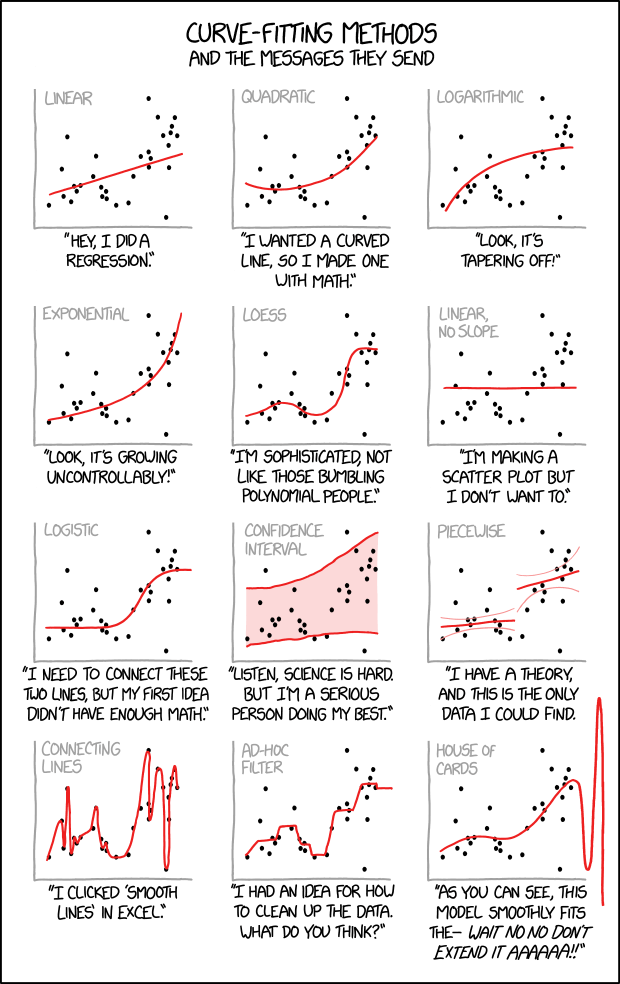

```{r, include=FALSE}
knitr::opts_chunk$set(
  echo = TRUE, message=FALSE, warning = FALSE, error= FALSE
)
```

{width=50% height=50%}

# Regression Models

The simplest regression model is linear with one predictor

$$y=a+bx+\epsilon$$
where $\epsilon$ is error, a and b are coefficients (parameters) and y and x are variables.

Generalizations:

* Multiple Linear Regression, 

$$y=\beta_o+\beta_1 x_1 + \beta_2 x_2 +...+\beta_k x_k + \epsilon$$
or in matrix form:  $$y=X\beta +\epsilon$$

* Models that allow for non-linear responses and predictors such as:
$$ \log(y) = a +b\log(x) + \epsilon$$

* Models that allow for interaction, aka nonadditive models

$$y=\beta_o+\beta_1 x_1 + \beta_2 x_2 +\beta_3 x_1 x_2 + \epsilon$$
* Generalized Linear Models which are of the form,

$$ g(y) = X\beta +\epsilon $$
where we can model data that does not fit the normal model well, such as binary data.  

## Simple Simulations

```{r message=FALSE}
library("arm")
library(rstanarm)
```

```{r }
x <- 1:20
n <- length(x)
a <- 0.2
b <- 0.3
sigma <- 0.5
# set the random seed to get reproducible results
# change the seed to experiment with variation due to random noise
set.seed(2141) 
y <- a + b*x + sigma*rnorm(n)
fake <- data.frame(x, y)
```

**Linear least squares regression**

```{r }
fit <- lm(y ~ x, data=fake)
summary(fit)
```
So our estimated linear model is:

$$\hat{y} = 0.4 +0.28x $$
note df= n - #estimated coefficients = 20-2 = 18


**Plot Simulated Regression**

```{r }
plot(fake$x, fake$y, main="Data and fitted regression line", bty="l", pch=20,
     xlab = "x", ylab = "y")
a_hat <- coef(fit)[1]
b_hat <- coef(fit)[2]
abline(a_hat, b_hat)
x_bar <- mean(fake$x)
text(x_bar, a_hat + b_hat*x_bar, paste("   y =", round(a_hat, 2), "+", round(b_hat, 2), "* x"), adj=0)
```

You can also estimate the model using stan_glm, this is what is in the book.
```{r}
fit <- stan_glm(y~x,data=fake,refresh=0)
print(fit)
```

#### Formulating comparisons as regression models

**Simulate fake data**

```{r }
n_0 <- 20
# set the random seed to get reproducible results
# change the seed to experiment with variation due to random noise
set.seed(2141)
y_0 <- rnorm(n_0, 2, 5)
y_0 <- round(y_0, 1)
round(y_0, 1)
round(mean(y_0), 2)
round(sd(y_0)/sqrt(n), 2)
```

**Estimating the mean is the same as regressing on a constant term**

```{r }
mean(y_0)
summary(lm(y_0 ~ 1))
```

**Simulate fake data**

```{r }
n_1 <- 30
# set the random seed to get reproducible results
# change the seed to experiment with variation due to random noise
set.seed(2141)
y_1 <- rnorm(n_1, 8, 5)
diff <- mean(y_1) - mean(y_0)
se_0 <- sd(y_0)/sqrt(n_0)
se_1 <- sd(y_1)/sqrt(n_1)
se <- sqrt(se_0^2 + se_1^2)
print(diff)
print(se)
```

**Estimating a difference is the same as regressing on an indicator variable**

```{r }
n <- n_0 + n_1
y <- c(y_0, y_1)
x <- c(rep(0, n_0), rep(1, n_1))  #x is 0 or 1
fit <- lm(y ~ x)
summary(fit)
```

So, this means 6.687 is the difference between the sample mean for y when x=1 and the sample mean for y when x=0.


```{r }
plot(x, y, xlab="Indicator, x", ylab="y", bty="l", xaxt="n", main="Regression on an indicator is the same\nas computing a difference in means",  pch=19, cex=.5)
axis(1, c(0, 1))
abline(h=mean(y[x==0]), lty=2, col="gray50")
abline(h=mean(y[x==1]), lty=2, col="gray50")
abline(coef(fit)[1], coef(fit)[2])
text(.5, -1 + coef(fit)[1] + .5*coef(fit)[2], paste("y =", fround(coef(fit)[1], 2), "+", fround(coef(fit)[2], 2), "x"), cex=.9, adj=0)
text(.05, -1 + mean(y[x==0]), expression(paste(bar(y)[0], " =")), col="gray30", cex=.9, adj=0)
text(.95, 1 + mean(y[x==1]), expression(paste(bar(y)[1], " =")), col="gray30", cex=.9, adj=1)
```


## Historical Origins and Regression to the Mean

Load packages.

```{r message=FALSE}
library(ggplot2)
library(rstanarm)
library(HistData)
```

### data

Import the data.
```{r }
heights <- read.table("~/SharedProjects/Kapitula/STA631/ROS/ROSExamples/PearsonLee/data/Heights.txt", header=TRUE)
daughter_height <- heights$daughter_height
mother_height <- heights$mother_height
n <- length(mother_height)
```

### mothers' heights.

Display the distribution of the mother's heights in a histogram, and calculate the mean and standard deviation of this distribution.

```{r message=FALSE}
ggplot(heights, aes(mother_height)) +
  geom_histogram(binwidth = 1,
                 color = "turquoise4", fill = "mediumturquoise") +
  labs(x = "Mothers' heights (in)",
       title = "Mothers' Heights")
```

The distribution of the mother's heights has mean `r round(mean(heights$mother_height), 3)` and standard deviation `r round(sd(heights$mother_height), 3)`.

### daughters' heights.

Do the same for the distribution of the daughter's heights.

```{r message=FALSE}
ggplot(heights, aes(daughter_height)) +
  geom_histogram(binwidth = 1,
                 color = "orchid1", fill = "orchid") +
  labs(x = "Daughters' heights (in)",
       title = "Daughters' Heights")
```

The distribution of the daughter's heights has mean `r round(mean(heights$daughter_height), 2)` and standard deviation `r round(sd(heights$daughter_height), 2)`.

### scatterplot

Pearson and Lee, 1903, were particularly interested in how these two variables were related.

```{r}
ggplot(heights, aes(mother_height, daughter_height)) +
  geom_jitter(pch = 20, color = "darkred") +
    labs(x = "Mother's height (in)", 
       y = "Daughter's height (in)",
       title = "Mothers and Daughters") 
  
```

### numerical summary

Distributions such as this one are often described by five numbers : 

-   the mean and standard deviation of the $x$ data
-   the mean and standard deviation of the $y$ data, and
-   the correlation of $x$ and $y$, denoted $r$

The correlation describes the strength of the linear relationship. For this bivariate distribution, the correlation between the mother's heights and their daughter's heights is 
`r round(cor(heights$mother_height, heights$daughter_height), 3)`.

You can summarize such distributions in compact tables, such as

> family     | height      | SD          | r
> -----------|-------------|-------------|-----
> mothers    | 62.5  inches | 2.4 inches |
> daughters  | 63.8 inches  | 2.6 inches | 0.49

or

\begin{alignat*}{3}
\text{mother's heights}   &\approx \text{62.5 inches} \qquad &\text{SD} &\approx \text{2.4 inches}  \qquad & \\
\text{daughter's heights} &\approx \text{63.8 inches}        &\text{SD} &\approx \text{2.6 inches}        &r \approx 0.49
\end{alignat*}

## regression

### loess smoother

Loess curves use **local regression** to track the average value of $y$ for each value of $x$.

```{r message=FALSE}
ggplot(heights, aes(mother_height, daughter_height)) +
  geom_jitter(pch = 20, color = "darkred") +
  geom_smooth(color = "orange") +
  labs(x = "Mother's height (in)", 
       y = "Daughter's height (in)",
       title = "Mothers and Daughters")
```


### regression line

The loess curve is fairly close to a straight line, except where there is very little data, suggesting that a  **regression line** might fairly represent the relationship between $x$ and $y$.

```{r}
ggplot(heights, aes(mother_height, daughter_height)) +
  geom_jitter(pch = 20, color = "darkred") +
  geom_smooth(method = "lm", color = "orange") +
  labs(x = "Mother's height (in)", 
       y = "Daughter's height (in)",
       title = "Mothers and Daughters")
```

### equation of the regression line

Calculate the equation of the regression line.
$$\hat{y} = a + bx =$$

```{r}
heights.lm <- lm(daughter_height ~ mother_height, data = heights)
coefficients(heights.lm)
```
The intercept is meaningless because it would be the predicted height when mother's height is 0 and that is not possible. Sometimes people rescale the model so results can be seen relative to the mean height of mothers. 


Calculate the predicted height of a daughter whose mother's height was the average height of all mothers.

```{r}
29.7984062  +   0.5449368*mean(mother_height)
```


Calculate the predicted height of a daughter whose mother's height was one standard deviation below the mean for the heights of mothers ... and do the same for two standard deviations.
```{r}
29.7984062  +   0.5449368*(mean(mother_height)-sd(mother_height))
29.7984062  +   0.5449368*(mean(mother_height)-2*sd(mother_height))
```

Calculate the predicted height of a daughter whose mother's height was one standard deviation above the mean for the heights of mothers ... and do the same for two standard deviations.

```{r}
29.7984062  +   0.5449368*(mean(mother_height)+sd(mother_height))
29.7984062  +   0.5449368*(mean(mother_height)+2*sd(mother_height))
```

Hint for questions above, another formula for the estimated slope of a regression line b is:

$$ b = r(s_y/s_x) $$
or you can just brute force it.


```{r}
mean(mother_height)
mean(mother_height)-sd(mother_height)
mean(mother_height)-2*sd(mother_height)
mean(mother_height)+sd(mother_height)
mean(mother_height)+2*sd(mother_height)
```

Display your results in a table. What do you observe?


height   | -2s | -s | 0 | s | 2s |
---------|-----|----|--- |---|----|
mother   | 57.7 |  60.1 | 62.5   | 64.9   | 67.3  |    
daughter |61.2   | 62.5   |  63.9 | 65.1  | 66.5   |

Table: **Mothers and Daughters**

Use `predict` to check your numbers.

```{r}
new.data <- data.frame(mother_height = mean(heights$mother_height) + 
                         sd(heights$mother_height) * c(-2, -1, 0, 1, 2))
data.frame(m = new.data,
           daughter_height = predict(heights.lm, new.data))
```
## The paradox of regression to the mean

### regression towards the mean


Pearson and Lee observed the same thing. This phenomenon came to be known as "regression towards the mean," and this is the origin of the modern term 'regression.'

### summary

This comes into play in other situations as well.  Example, suppose a teacher berates students who score in the bottom 10% on a standardized test, then the teacher has the students take a new version of the test with the same difficulty later, the students do better, so the teacher assumes berating works great.  Similarly, this is why it is not always worth it to retake a standardized test if a person scores very well.  Example (made up score), say a student gets a 750 out of 800 on a portion of the SAT.  If the student takes another test on another day of the same difficulty as the first and there was no learning or practice effect it is expected that their score would go down. 

