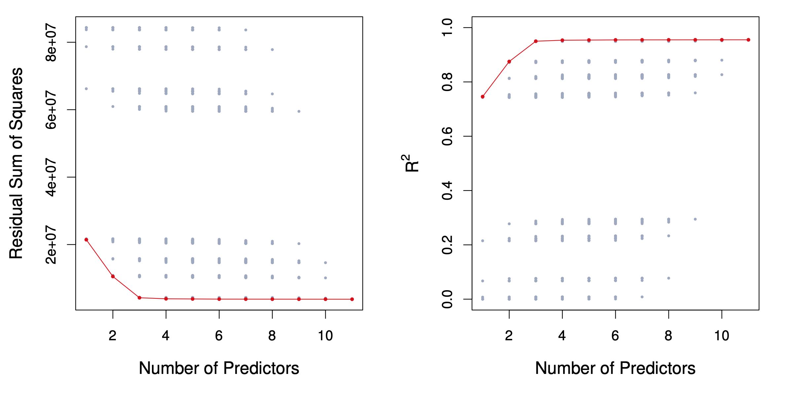

```{r setup, include=FALSE}
knitr::opts_chunk$set(echo = TRUE, message=FALSE, warning=FALSE)
```

```{r start, results=FALSE}
library(ISLR) #contains the credit data
library(tidyverse)
library(moderndive)
theme_set(theme_classic())
```
some of the data analysis below is adapted from 
http://www.science.smith.edu/~jcrouser/SDS293/labs/lab8-r.html
## Model Selection and Shrinkage

Recall the linear model
$$Y=\beta_0 + \beta_1X_1+ \beta_2X_2 + \beta_pX_p $$ 

* How can we find a sweet spot in the variance bias trade-off?
* We consider some approaches for model selection and regularization (ie shrinkage).


## Three classes of methods

* __Subset Selection__. We identify a subset of the p predictors
that we believe to be related to the response. We then fit a
model using least squares on the reduced set of variables.
* __Shrinkage__. We fit a model involving all p predictors, but
the estimated coefficients are shrunken towards zero
relative to the least squares estimates. This shrinkage (also
known as regularization) has the effect of reducing variance
and can also perform variable selection.
* __Dimension Reduction__. This is also sometimes called automatic feature creation.  We project the p predictors into a M-dimensional subspace, where M < p. This is achieved by
computing M different linear combinations, or projections,
of the variables. Then these M projections are used as
predictors to fit a linear regression model by least squares.

## Subset Selection

_Best subset and stepwise model selection procedures_

## Best Subset Selection

1. Let $M_o$ denote the null model, which contains no
predictors. This model simply predicts the sample mean
for each observation.
2. For $k = 1, 2, ...,p$:
  a. Fit all ${p \choose k} = p!/\left[k!(p-k)!\right]$ combinations of models that contain exactly models that contain exactly k predictors.
  b.  Pick the best among these models and call it $M_k$. Here best can be defined as having the smallest $RSS$, or equivalently
largest $R^2$.
3. Select a single best model from among $M_0,...,M_p$ using
cross-validated prediction error, $C_p$(AIC), BIC, or adjusted $R^2$.

## Example- Credit data set
```{r, echo=FALSE}

```
For each possible model containing a subset of the ten predictors
in the Credit data set, the RSS and $R^2$ are displayed. The red
frontier tracks the best model for a given number of predictors,
according to RSS and  $R^2$. Though the data set contains only
ten predictors, the x-axis ranges from 1 to 11, since one of the
variables is categorical and takes on three values, leading to the
creation of two dummy variables.

Note that tidymodels does not do best subsets, or variable selection, this is because LASSO, Ridge, Bayesian and ElasticNet are typically better methods.  The LASSO allows for model selection as well. 

Best subset with `regsubsets`
```{r}
data(Credit, package = "ISLR")
library(leaps) # where regsubsets is found
regfit_full= regsubsets(Balance ~ ., data=Credit[2:12]) #id is in column 1, so I leave it off
reg_summary=summary(regfit_full)
reg_summary
```
Best model with 4 variables includes: Income, Limit, Cards,  Student.

## Choosing k

Naturally, RSS and $R^2=1−RSS/TSS$ improve as we increase k.

To optimize k, we want to minimize the test error, not the training error.

We could use cross-validation, or alternative estimates of test error:

* Akaike Information Criterion (AIC) (closely related to Mallow’s $C_p$) given an estimate of the irreducible error $\hat{\sigma^2}$ :
$$\frac{1}{n}(\text{RSS}+2k\hat\sigma^2)$$
* Bayesian Information Criterion (BIC):

$$\frac{1}{n}(\text{RSS}+\log(n)k\hat\sigma^2)$$
* Adjusted R2:

$$R^2_a = 1-\frac{\text{RSS}/(n-k-1)}{\text{TSS}/(n-1)}$$
Notice that rather than letting the results of our call to the `summary()` function print to the screen, we've saved the results to a variable called `reg_summary`. That way, we can access just the parts we need. Let's see what's in there:

```{r}
names(reg_summary)
```

Excellent! In addition to the verbose output we get when we print the summary to the screen, the `summary()` function also returns $R^2 (\tt{rsq})$, RSS, adjusted $R^2$, $C_p$, and BIC. We can examine these to try to select the best overall model. Let's start by looking at $R^2$:

```{r}
reg_summary$rsq
```

We see that the $R^2$ statistic increases from 75% when only
one variable is included in the model to over 95% when all variables
are included. As expected, the $R^2$ statistic increases monotonically as more
variables are included.

Plotting RSS, adjusted $R^2$, $C_p$, and BIC for all of the models at once will
help us decide which model to select. Note the `type="l"` option tells `R` to
connect the plotted points with lines:


```{r}
# code below from http://www.science.smith.edu/~jcrouser/SDS293/labs/lab8-r.html
# Set up a 2x2 grid so we can look at 4 plots at once
par(mfrow = c(2,2))
plot(reg_summary$rss, xlab = "Number of Variables", ylab = "RSS", type = "l")
plot(reg_summary$adjr2, xlab = "Number of Variables", ylab = "Adjusted RSq", type = "l")

# We will now plot a red dot to indicate the model with the largest adjusted R^2 statistic.
# The which.max() function can be used to identify the location of the maximum point of a vector
adj_r2_max = which.max(reg_summary$adjr2) 
# The points() command works like the plot() command, except that it puts points 
# on a plot that has already been created instead of creating a new plot
points(adj_r2_max, reg_summary$adjr2[adj_r2_max], col ="red", cex = 2, pch = 20)

# We'll do the same for C_p and BIC, this time looking for the models with the SMALLEST statistic
plot(reg_summary$cp, xlab = "Number of Variables", ylab = "Cp", type = "l")
cp_min = which.min(reg_summary$cp) 
points(cp_min, reg_summary$cp[cp_min], col = "red", cex = 2, pch = 20)

plot(reg_summary$bic, xlab = "Number of Variables", ylab = "BIC", type = "l")
bic_min = which.min(reg_summary$bic) 
points(bic_min, reg_summary$bic[bic_min], col = "red", cex = 2, pch = 20)
```
Recall that in the second step of our selection process, we narrowed the field down to just one model on any $k<=p$ predictors. We see that according to BIC, the best performer is the model with 4 variables. According to $C_p$, 6 variables. Adjusted $R^2$ suggests that 7 might be best. No one measure and no one model will necessarily be flagged as best.

The `regsubsets()` function has a built-in `plot()` command which can
be used to display the selected variables for the best model with a given
number of predictors, ranked according to a chosen statistic.  The top row of each plot contains a black square for each variable selected according to the optimal model associated with that statistic. 

To find out more about this function, type `?plot.regsubsets`.

```{r}
plot(regfit_full, scale="r2")
```

As expected, $R^2$ is maximized by the model that contains all the predictors.

```{r}
plot(regfit_full, scale="adjr2")
```

Adjusted $R^2$ downselects to  7 predictors. We can use the `coef()` function to see which predictors made the cut:

```{r}
coef(regfit_full, 7)
```

```{r}
plot(regfit_full, scale="Cp")
```

$C_p$ downselects further to 6 variables.

```{r}
coef(regfit_full, 6)
```

```{r}
plot(regfit_full, scale="bic")
```

We see that several models share a BIC close to -1200. However, the model
with the lowest BIC is the four-variable model given below.

```{r}
coef(regfit_full, 4)
```

# Forward and Backward Stepwise Selection

For computational reasons, best subset selection cannot be
applied with very large p. Why not?

* Best subset selection may also suffer from statistical
problems when p is large: larger the search space, the
higher the chance of finding models that look good on the
training data, even though they might not have any
predictive power on future data.
* Thus an enormous search space can lead to overfitting and
high variance of the coefficient estimates.
* For both of these reasons, stepwise methods, which explore
a far more restricted set of models, are attractive
alternatives to best subset selection.

There are simulations that have been done that have shown Stepwise methods will often not work well at finding important predictive variables so do remember just because a stepwise method drops or brings in a variable it does NOT mean that variable is necessarily important or not-important.  If your only goal is prediction and you use cross-validation to evaluate the models suggested by stepwise methods they can be used to find a decent predictive model, but I would recommend using a shrinkage method over stepwise.  I would NEVER recommend using stepwise using p-value for model selection.  Remember once you do model selection your p-values are basically meaningless because all the theory assumes you know the correct model before you start.  

## Forward Stepwise Selection

* Forward stepwise selection begins with a model containing
no predictors, and then adds predictors to the model,
one-at-a-time, until all of the predictors are in the model.
* In particular, at each step the variable that gives the
greatest _additional_ improvement to the fit is added to the
model.

* In Detail
1. Let $M_o$ denote the null model, which contains no
predictors. This model simply predicts the sample mean
for each observation.
2. For $k = 0,1, 2, ...,p-1$:
  a. Consider all  all $p - k$ models that augment the predictors in
$M_k$ with one additional predictor.  
  b.  Choose the _best_ among these $p-k$ models and call it $M_{k+1}$. Here _best_ is defined as having the smallest $RSS$, or equivalently
largest $R^2$.
3. Select a single best model from among $M_0,...,M_p$ using
cross-validated prediction error, $C_p$(AIC), BIC, or adjusted $R^2$.

That forward stepwise selection has a computational advantage over best subset selection is
clear.  However, it is not guaranteed to find the best possible model out of all $2^p$ models ubsets of the p predictors.

We can also use the `regsubsets()` function to perform forward stepwise
or backward stepwise selection, using the argument `method="forward"` or
`method="backward"`.

```{r}
# Forward
regfit_fwd = regsubsets(Balance ~ ., data=Credit[2:12], nvmax=11, method="forward")
summary(regfit_fwd)
```
Compare the models with 1-4 predictors here to what we got for best subsets.  What do you notice?
First three are the same, but 4 predictor model is different.

## Backward Stepwise Selection

* Like forward stepwise selection, backward stepwise selection
provides an efficient alternative to best subset selection.
* However, unlike forward stepwise selection, it begins with
the full least squares model containing all p predictors, and
then iteratively removes the least useful predictor, one-at-a-time.

* In Detail
1. Let $M_p$ denote the full model, which contains all the 
predictors. 
2. For $k =p, p-1, ..., 1 $:
  a. Consider all  all $k$ models that contain all but one of the predictors in $M_k$ for a total of $k-1$ predictors. 
  b.  Choose the _best_ among these $k$ models and call it $M_{k-1}$. Here _best_ is defined as having the smallest $RSS$, or equivalently
largest $R^2$.
3. Select a single best model from among $M_0,...,M_p$ using
cross-validated prediction error, $C_p$(AIC), BIC, or adjusted $R^2$.

* Like forward stepwise selection, the backward selection
approach searches through only $1 + p(p + 1)/2$ models, and
so can be applied in settings where p is too large to apply
best subset selection
* Like forward stepwise selection, backward stepwise
selection is not guaranteed to yield the _best_ model
containing a subset of the $p$ predictors.
* Backward selection requires that the _number of samples n
is larger than the number of variables p_ (so that the full
model can be fit). In contrast, forward stepwise can be
used even when $n < p$, and so is the only viable subset
method when $p$ is very large.

For the `Credit` data.
```{r}
# Backward
regfit_bwd = regsubsets(Balance ~ ., data=Credit[2:12], nvmax=11, method="backward")
summary(regfit_bwd)
```

We see that using forward stepwise selection, the best one variable
model contains only `CRBI`, and the best two-variable model additionally
includes `Hits`. For this data, the best one-variable through six-variable
models are each identical for best subset and forward selection.
However, the best seven-variable models identified by forward stepwise selection,
backward stepwise selection, and best subset selection are different.

```{r}
models=
for (k in 1:5){
full=coef(regfit_full, k)
fwd=coef(regfit_fwd, k)
bwd=coef(regfit_bwd, k)
print(full)
print(fwd)
print(bwd)}
```
# Model selection using the Validation Set Approach

We see above that it is possible to choose among a set of models of different
sizes using $C_p$, BIC, and adjusted $R^2$. We will now consider how to do this
using the validation set and cross-validation approaches.

How do these criteria above compare to cross validation?

* They are much less expensive to compute.

* They are motivated by asymptotic arguments and rely on model assumptions (eg. normality of the errors).

* Equivalent concepts for other models (e.g. logistic regression).

## Important Point about using Validation Approach
In order for these approaches to yield accurate estimates of the test
error, we must use *only the training observations* to perform all aspects of
model-fitting including variable selection. Therefore, the determination of
which model of a given size is best must be made using *only the training
observations*. If the full data set is used
to perform the best subset selection step, the validation set errors and
cross-validation errors that we obtain will not be accurate estimates of the
test error.

In order to use the validation set approach, we begin by splitting the
observations into a training set and a test set as before. Here, we've decided to split the data into three-quarters for training and one-quarter for test using the `sample_frac()` method:

```{r}
set.seed(1)

train = Credit[2:12] %>%
  sample_frac(0.75)

test = Credit[2:12] %>%
  setdiff(train)
```

Now, we apply `regsubsets()` to the training set in order to perform best
subset selection.

```{r}
regfit_best_train = regsubsets(Balance~., data = train, nvmax = 11)  #do best subsets on the training data.
summary(regfit_best_train)
```

Notice that we use the training data here. We now compute the validation set error for the best
model of each model size. We first make a model matrix from the test
data.

```{r}
test_mat = model.matrix (Balance~., data = test)
```

The `model.matrix()` function is used in many regression packages for building an $X$ matrix from data. Now we run a loop, and for each size $i$, we
extract the coefficients from `regfit.best` for the best model of that size,
multiply them into the appropriate columns of the test model matrix to
form the predictions, and compute the test MSE.

```{r}
#we use 11 because we have 11 predictors possible.
val_errors = rep(NA,11)

# Iterates over each size i
for(i in 1:11){
    
    # Extract the vector of predictors in the best fit model on i predictors
    coefi = coef(regfit_best_train, id = i)
    
    # Make predictions using matrix multiplication of the test matirx and the coefficients vector
    pred = test_mat[,names(coefi)]%*%coefi
    
    # Calculate the MSE
    val_errors[i] = mean((test$Balance-pred)^2)
}
```

Now let's plot the errors, and find the model that minimizes it:

```{r}
# Find the model with the smallest error
min = which.min(val_errors)
min
# Plot the errors for each model size
plot(val_errors, type = 'b')
points(min, val_errors[min][1], col = "red", cex = 2, pch = 20)
```

Viola! We find that the best model (according to the validation set approach) is the one that contains 4 predictors.

This was a little tedious, partly because there is no `predict()` method
for `regsubsets()`. Since we will be using this function again, we can capture
our steps above and write our own `predict()` method:

```{r}
predict.regsubsets = function(object,newdata,id,...){
      form = as.formula(object$call[[2]]) # Extract the formula used when we called regsubsets()
      mat = model.matrix(form,newdata)    # Build the model matrix
      coefi = coef(object,id=id)          # Extract the coefficiants of the ith model
      xvars = names(coefi)                # Pull out the names of the predictors used in the ith model
      mat[,xvars]%*%coefi               # Make predictions using matrix multiplication
}
```

This function pretty much mimics what we did above. The one tricky
part is how we extracted the formula used in the call to `regsubsets()`, but you don't need to worry too much about the mechanics of this right now. We'll use this function to make our lives a little easier when we do cross-validation.

Now that we know what we're looking for, let's perform best subset selection on the full dataset (up to 4 predictors) and select the best 4-predictor model. It is important that we make use of the *full
data set* in order to obtain more accurate coefficient estimates. Note that
we perform best subset selection on the full data set and select the best 4-predictor
model, rather than simply using the predictors that we obtained
from the training set, because the best 4-predictor model on the **full data
set** may differ from the corresponding model on the training set.

```{r}
regfit_best = regsubsets(Balance~., data = Credit[2:12], nvmax = 4)
```

Here they are the same.

```{r}
coef(regfit_best, 4)
coef(regfit_best_train, 4)
```

# Model selection using Cross-Validation

Now let's try to choose among the models of different sizes using cross-validation.
This approach is somewhat involved, as we must perform best
subset selection\* within each of the $k$ training sets. Despite this, we see that
with its clever subsetting syntax, `R` makes this job quite easy. First, we
create a vector that assigns each observation to one of $k = 10$ folds, and
we create a matrix in which we will store the results:

\* or forward selection / backward selection

```{r}
k = 10        # number of folds  
set.seed(1)   # set the random seed so we all get the same results

# Assign each observation to a single fold
folds = sample(1:k, nrow(Credit), replace = TRUE)

# Create a matrix to store the results of our upcoming calculations, 
#we use 11 because we have 11 possible predictors (10 variables 1 with 3 levels)
cv_errors = matrix(NA, k, 11, dimnames = list(NULL, paste(1:11)))
```

Now let's write a for loop that performs cross-validation. In the $j^{th}$ fold, the
elements of folds that equal $j$ are in the test set, and the remainder are in
the training set. We make our predictions for each model size (using our
new $predict()$ method), compute the test errors on the appropriate subset,
and store them in the appropriate slot in the matrix `cv.errors`.

```{r}
# Outer loop iterates over all folds
for(j in 1:k){
    
    # The perform best subset selection on the full dataset, minus the jth fold
    best_fit = regsubsets(Balance~., data = Credit[folds!=j,2:12], nvmax=11)
    
    # Inner loop iterates over each size i
    for(i in 1:11){
        
        # Predict the values of the current fold from the "best subset" model on i predictors
        pred = predict(best_fit, Credit[folds==j,2:12], id=i)
        
        # Calculate the MSE, store it in the matrix we created above
        cv_errors[j,i] = mean((Credit$Balance[folds==j]-pred)^2)
    }
}
```

This has filled up the `cv_._errors` matrix such that the $(i,j)^{th}$ element corresponds
to the test MSE for the $i^{th}$ cross-validation fold for the best $j$-variable
model.  We can then use the `apply()` function to take the `mean` over the columns of this
matrix. This will give us a vector for which the $j^{th}$ element is the cross-validation
error for the $j$-variable model.

```{r}
# Take the mean of over all folds for each model size
mean_cv_errors = apply(cv_errors, 2, mean)

# Find the model size with the smallest cross-validation error
min = which.min(mean_cv_errors)

# Plot the cross-validation error for each model size, highlight the min
plot(mean_cv_errors, type='b')
points(min, mean_cv_errors[min][1], col = "red", cex = 2, pch = 20)
```

We see that cross-validation selects 6-predictor model. Now let's use
best subset selection on the full data set in order to obtain the 6-predictor
model.

```{r}
reg_best = regsubsets(Balance~., data = Credit[2:12], nvmax = 6)
coef(reg_best, 6)
```

For comparison, let's also take a look at the statistics from above:

```{r}
par(mfrow=c(2,2))

reg_summary = summary(reg_best)

# Plot RSS
plot(reg_summary$rss, xlab = "Number of Variables", ylab = "RSS", type = "l")

# Plot Adjusted R^2, highlight max value
plot(reg_summary$adjr2, xlab = "Number of Variables", ylab = "Adjusted RSq", type = "l")
max = which.max(reg_summary$adjr2)
points(max, reg_summary$adjr2[max], col = "red", cex = 2, pch = 20)

# Plot Cp, highlight min value
plot(reg_summary$cp, xlab = "Number of Variables", ylab = "Cp", type = "l")
min = which.min(reg_summary$cp)
points(min,reg_summary$cp[min], col = "red", cex = 2, pch = 20)

# Plot BIC, highlight min value
plot(reg_summary$bic, xlab = "Number of Variables", ylab = "BIC", type = "l")
min = which.min(reg_summary$bic)
points(min, reg_summary$bic[min], col = "red", cex = 2, pch = 20)
```

Notice how some of the indicators agree with the cross-validated model, and others are very different?

Next time we will walk through using Shrinkage Methods and dimension reduction when you have a lot of predictors.  